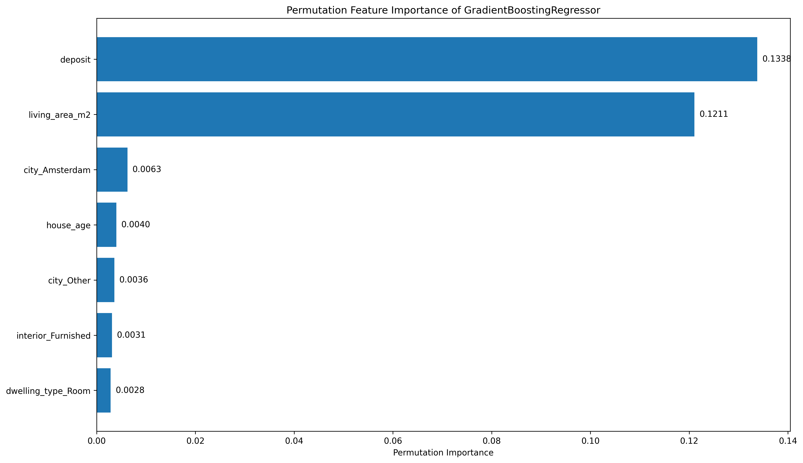

# House Searching Helper

**House Searching Helper** is designed to give people looking for accommodation deeper insights into the housing market. This project used Scrapy to scrape data from a popular Dutch rental website to gather the latest information, which is stored in a regularly updated MySQL database. The project features two main applications: the **PowerBI Search Dashboard** and the **Price Prediction Machine Learning Models**. Here you can see the workflow of the Project:

---

## PowerBI Search Dashboard

The **PowerBI Search Dashboard** makes finding your dream accommodation easier and faster. With this dashboard, users can apply filters to search for accommodations that meet their needs. But that's not all—this tool provides valuable insights into the housing market:

- 🏢 **Discover Ownership Trends**: Find out which agents own the most properties in your chosen category.
- 📍 **Explore Locations**: Identify the specific regions where these properties are located.
- 💡 **Save Time and Money**: Use these insights to make smarter choices and streamline your house-hunting process.
- 🎥 **Demo**:

---

## Price Prediction Machine Learning Models

To help users better understand rental prices and the factors influencing them, the project includes several **machine learning models** to predict rent based on multiple features. The models used include:

- **Linear Regression**
- **Decision Tree**
- **Random Forest**
- **Gradient Boosting Regressor**
- **Stacking Model**

### Best Performing Model: Gradient Boosting Regressor
The **Gradient Boosting Regressor** achieved:
- **Mean Squared Error (MSE):** 0.0368
- **R-Squared Value:** 0.8805

This shows that the model has a strong predictive ability and can estimate rent with high accuracy.

### Model Insights
To uncover what drives rental prices, I used:
- **SHAP (SHapley Additive exPlanations)**: Explains how each feature influences predictions.

- **Permutation Feature Importance**: Highlights the most impactful features.

These insights help potential tenants understand how factors like location, property size, and amenities affect rent, enabling smarter decisions.

---

## Why Use House Searching Helper?

With its combination of advanced analytics and user-friendly tools, **House Searching Helper** can help smarter decision-making in the rental market, whether you’re:

- Looking to save money 💰
- Optimizing your search process 🕒
- Gaining a better understanding of housing prices 📊

 **House Searching Helper** can make your house hunt easier and more informed! 🚀
